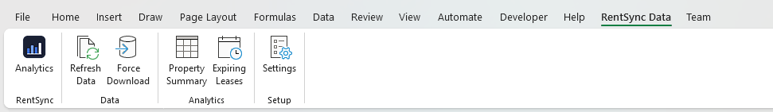
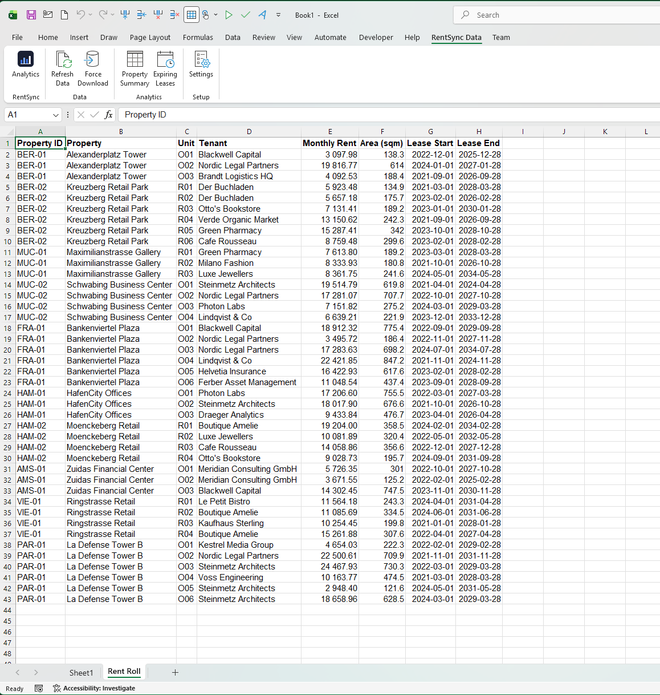
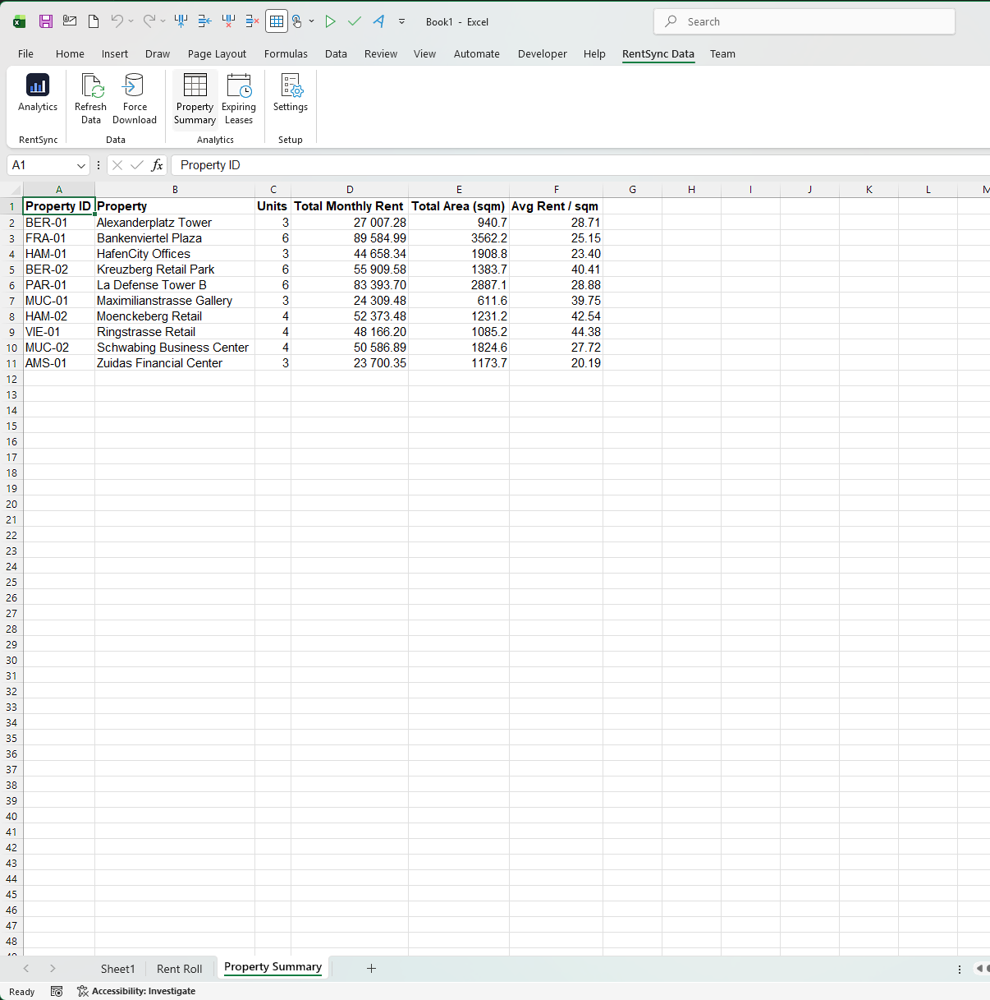
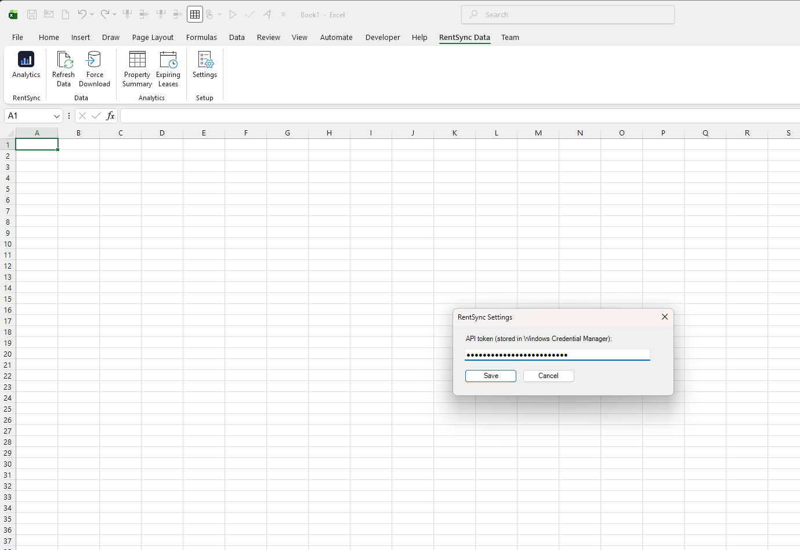

# RentSync Analytics

An Excel **VSTO add-in** that pulls rent roll data from a REST API, caches it locally
in **DuckDB**, and writes analytics back into the worksheet — with structured logging
and client-side telemetry throughout.

> **Independent portfolio project.** Built to demonstrate Excel VSTO add-in
> engineering. It is not affiliated with, derived from, or connected to any
> commercial product, and contains no third-party proprietary code. The API layer
> targets a public demo endpoint.

---

## Why this project exists

Commercial real-estate teams live in Excel. A rent roll arrives as a spreadsheet,
gets analysed in a spreadsheet, and is reported from a spreadsheet. An add-in that
brings live, cached, queryable data into that workflow removes the copy-paste step
entirely.

This repository is my working answer to the engineering problems that come with
building such an add-in: talking to a network that fails, keeping Excel responsive,
storing data locally so users are not re-downloading the same rows, and being able
to tell — after the fact — what the add-in actually did on a user's machine.

---

## Screenshots

### Ribbon



The add-in registers its own **RentSync Data** tab, organised into four groups:
branding, data retrieval, analytics and setup. A group-level logo is the deepest
level of custom branding VSTO allows — Office does not expose tab-level icons to
COM add-ins.

### Rent Roll



**Refresh Data** writes the current rent roll to a dedicated worksheet: 42 lease
records across 10 European cities, covering both office and retail units. Rows are
served from a local DuckDB cache when available; **Force Download** bypasses the
cache and re-fetches from the API.

### Property Summary



Aggregates the rent roll by property — unit count, total monthly rent, total area
and average rent per square metre. The aggregation itself lives in `RentSync.Core`,
so it is covered by unit tests and runs without Excel.

### Settings



The API token is stored in the **Windows Credential Manager** rather than in a
configuration file or the registry, and is never written to the workbook.

> All figures shown are generated demo data.

---

## Architecture: a modern core inside a legacy host

VSTO add-ins load **in-process with Excel**, and Microsoft has stated that the VSTO
platform will remain on .NET Framework — .NET Core and .NET 5+ cannot coexist with
.NET Framework in a single process. `RentSync.AddIn` is therefore locked to
**.NET Framework 4.8**. That is a constraint of the platform, not a choice.

The response is to keep the Framework-bound surface as thin as possible:

```
┌──────────────────────────────────────────────┐
│  Excel process                               │
│                                              │
│  ┌────────────────────────────────────────┐  │
│  │  RentSync.AddIn   (.NET Framework 4.8) │  │
│  │  ribbon · Excel interop · WinForms     │  │
│  │  Credential Manager · VBA bridge       │  │
│  └───────────────────┬────────────────────┘  │
│                      │ references            │
│  ┌───────────────────▼────────────────────┐  │
│  │  RentSync.Core  (net10.0 ; net48)      │  │
│  │  REST · cache · analytics · telemetry  │  │
│  │  no Excel, no Office, no Windows deps  │  │
│  └───────────────────┬────────────────────┘  │
└──────────────────────┼───────────────────────┘
                       │ referenced by
            ┌──────────▼───────────┐
            │  RentSync.Tests      │
            │  xUnit, net10.0      │
            └──────────────────────┘
```

`RentSync.Core` **multi-targets `net10.0` and `net48`** from one source tree. The
add-in consumes the `net48` build; the test suite runs against `net10.0`. All the
logic worth testing lives in Core, so the test suite needs neither Excel nor Windows.

Multi-targeting is not free. The `net48` build cannot use `TimeSpan * double`,
`HttpStatusCode.TooManyRequests`, `Task.WaitAsync`, `ChannelReader.ReadAllAsync`, or
the `Dictionary(IEnumerable<KeyValuePair<,>>)` constructor. Some gaps are closed with
polyfill packages (PolySharp, `Portable.System.DateTimeOnly`,
`Microsoft.Bcl.AsyncInterfaces`); the rest are closed by writing the code so that a
single implementation compiles cleanly on both targets.

---

## What each requirement maps to

| Capability | Where it lives |
|---|---|
| VSTO add-in with ribbon UI | `RentSync.AddIn/RibbonUI.xml`, `RibbonController.cs` |
| Async/await without blocking Excel's UI thread | `RibbonController.RunAsync` |
| REST API integration, retry, backoff | `Core/Services/RestApiClient.cs` |
| Caching strategy to minimise downloads | `Core/Services/CacheService.cs`, `RentRollDataService.cs` |
| VBA ↔ VSTO interoperability | `AddIn/VbaBridge.cs` |
| Authentication & credential security | `AddIn/WindowsCredentialTokenProvider.cs`, `Core/Services/IAuthTokenProvider.cs` |
| Telemetry, logging, observability | `Core/Telemetry/`, `Core/ServiceCollectionExtensions.cs` |
| Unit testing | `RentSync.Tests/` — 11 tests |
| Dependency injection | `Core/ServiceCollectionExtensions.cs` |
| NuGet packaging & versioning | `RentSync.Core.csproj` (SemVer, package metadata) |
| Data-heavy processing | DuckDB bulk appender in `CacheService.StoreAsync` |

---

## Three decisions worth explaining

### Telemetry that cannot slow down or crash Excel

An add-in shares its process with the host application. Telemetry that blocks the UI
thread makes Excel stutter; telemetry that throws takes Excel down with it. Neither is
acceptable.

`TelemetryService` therefore does almost nothing on the calling thread: it serialises
an event into a bounded `Channel<T>` and returns. A single background task drains the
channel and appends JSON lines through one long-lived `StreamWriter`, flushing once
per drained batch rather than once per event. The channel is configured with
`BoundedChannelFullMode.DropOldest`, so under pressure the add-in loses telemetry
rather than memory. Sink failures are caught and logged inside the drain loop.

Every event carries a `SessionId`; timed operations carry an `OperationId`, a
duration, a success flag, and arbitrary properties — so a slow API call can be traced
back to the exact ribbon click that caused it, along with how many retry attempts it
took. Errors record the exception type and message only; full stack traces go to the
Serilog file sink, not into telemetry.

Logs are written as compact JSON (CLEF), readable directly by Seq or ELK.

### Retry logic that knows what is worth retrying

`RestApiClient` retries transient failures — 5xx, 408, 429, and network-level errors —
using exponential backoff with **full jitter**, so a fleet of add-ins recovering from
an outage does not hit the server in lockstep. `Retry-After` is honoured when the
server sends it. Non-transient failures (401, 404, malformed payload) fail immediately,
because retrying them only wastes the user's time.

That distinction is harder than it looks, and getting it wrong is what the test suite
caught: `HttpResponseMessage.EnsureSuccessStatusCode()` throws `HttpRequestException`,
which is the *same exception type* raised by a genuine connection failure. With status
handling inside the retry `catch` block, a `401 Unauthorized` was indistinguishable
from "connection refused" and was being retried. The fix was structural — the
`try/catch` now guards only the send, and status handling sits outside it. The
regression test asserts on call count, not just on the exception type:

```csharp
await Assert.ThrowsAsync<HttpRequestException>(() => client.FetchRentRollAsync());
Assert.Equal(1, handler.CallCount);   // 401 must NOT be retried
```

### Cache-first, with graceful degradation

`RentRollDataService` is the only thing the add-in calls for data. It serves the local
DuckDB snapshot when it is younger than the configured freshness window, and hits the
network only when it is not. If the API fails and a stale snapshot exists, it serves
the stale data and logs a warning rather than showing the user an error — an analyst
with slightly old numbers is better off than an analyst with an empty sheet.

DuckDB was chosen over SQLite because the cache is also the analytics engine: it is an
in-process OLAP store, aggregations run as SQL directly over the cached data, and bulk
loading goes through the native appender rather than row-by-row inserts.

---

## Excel interop performance

All Excel Object Model access is confined to `ExcelActions.cs` and runs only on the UI
thread. Data is written with a **single `Range.Value2` assignment from an `object[,]`
array** rather than cell by cell — every individual cell write is a COM round-trip, and
for a rent roll of any size that difference is measured in minutes.

---

## Testing

```bash
dotnet test
```

11 xUnit tests, no Excel and no network required. `ScriptedHttpHandler` replaces the
HTTP transport with queued canned responses, so retry behaviour is verified
deterministically in milliseconds. DuckDB tests run against an in-memory database.

Covered: successful parse, retry-until-success, fail-fast on non-transient status,
exhausted retries, telemetry operation properties, cache round-trip, snapshot
replacement, freshness expiry, property aggregation, lease-expiry filtering, and
telemetry buffer persistence.

---

## Building

**`RentSync.Core` and `RentSync.Tests`** build anywhere with the .NET 10 SDK:

```bash
dotnet restore
dotnet build
dotnet test
```

**`RentSync.AddIn`** requires Windows, Microsoft Excel, and the Visual Studio
*Office/SharePoint development* workload. See
[`RentSync.AddIn/SETUP_ADDIN.md`](RentSync.AddIn/SETUP_ADDIN.md).

---

## Status

Implemented: core services, telemetry, caching, analytics, test suite, ribbon and
interop layer.

Planned: styled settings and import dialogs, AI-assisted column mapping for
unstructured rent roll files, Entra ID sign-in via MSAL, FastReport PDF export,
WiX MSI installer, and a signed release pipeline.

---

## Licence

MIT — see [LICENSE](LICENSE).
